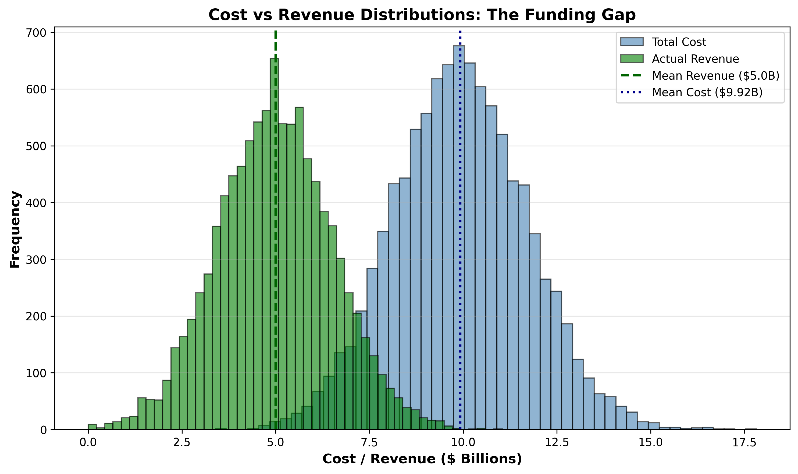
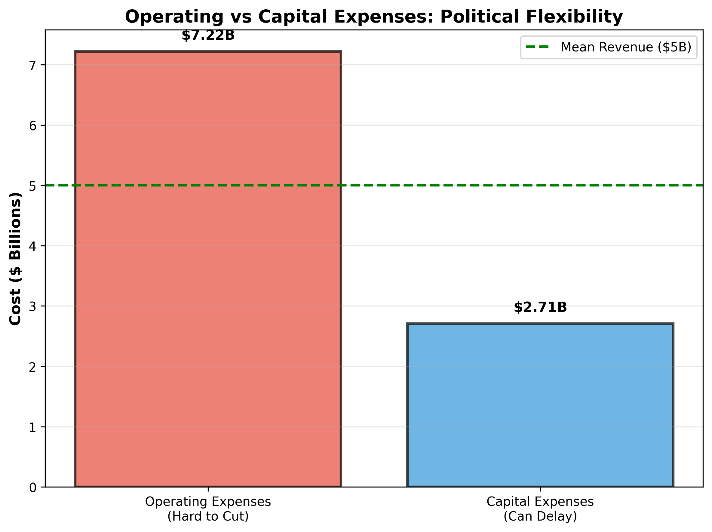
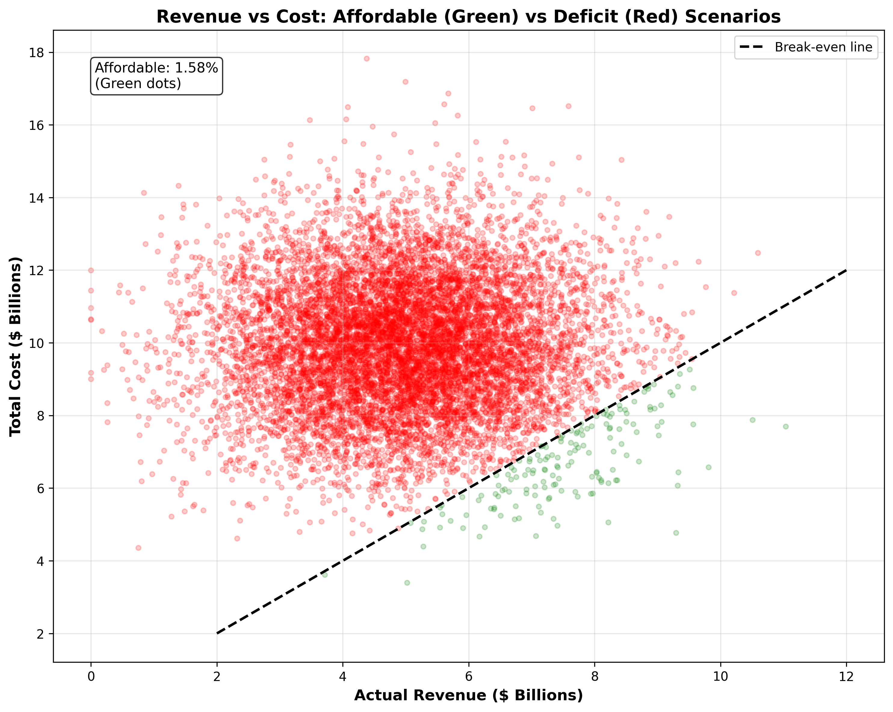
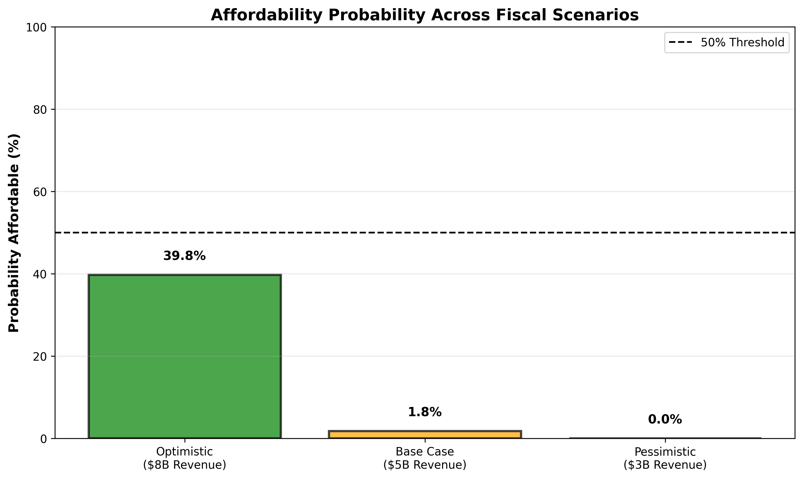

# Monte Carlo Fiscal Feasibility: Zohran Mamdani's NYC Mayoral Agenda

## What This Project Does

This project tests whether NYC mayoral candidate Zohran Mamdani's progressive policy agenda is fiscally affordable under realistic budget constraints and uncertainty. Using Monte Carlo simulation with 10,000 iterations, we model both **cost uncertainty** (policy overruns) and **revenue uncertainty** (tax collection volatility) to estimate the probability that his proposals fit within available funding.

**Inspiration:** After seeing [this Instagram reel](https://www.instagram.com/reel/DRN-ovfjOON/?igsh=MWMycDdmNXk3eG9seg==) discussing Mamdani's platform, I built this quantitative analysis to move beyond political rhetoric and evaluate fiscal reality.

---

## How the Budget Threshold Was Set

### The NYC Fiscal Reality (FY 2026)

| Constraint | Amount | Reality Check |
|------------|--------|---------------|
| **Total NYC Budget** | ~$118B | Restricted (federal/state grants, debt service) |
| **City Funds (Mayor's Control)** | ~$87B | Baseline operations, not "new money" |
| **Inherited Deficit** | -$4 to -$6B | Must close before funding new programs |
| **Mamdani's Revenue Goal** | $9-10B | Requires Albany approval (historically unlikely) |

### Our Model's Budget Threshold: **$5 Billion**

**Why $5B?**
1. **Albany Gatekeeping:** NYC cannot raise income or corporate taxes without state legislature approval. Governor Hochul has opposed such increases.
2. **Realistic Yield:** Independent fiscal watchdogs estimate Mamdani's proposals would generate $5-6B (not $9B) due to:
   - Wealthy taxpayer migration to avoid 2% wealth tax
   - Corporate tax avoidance strategies
   - Economic behavioral responses
3. **Best-Case Assumption:** This assumes *partial* Albany cooperation—already optimistic.

**Revenue as a Distribution (Not a Fixed Number):**
- **Mean:** $5B (expected value with partial Albany approval)
- **Std Dev:** $1.5B (30% volatility)
- **Why Uncertain?** Tax revenue fluctuates wildly with stock market performance, economic cycles, and political outcomes.

---

## Why Standard Deviation?

**Public sector costs don't follow a fixed script—they follow probability distributions.**

### Cost Uncertainty Sources:
1. **Enrollment/Demand Uncertainty:** Will 50% or 80% of families use universal childcare?
2. **Implementation Delays:** Hiring freezes, union negotiations, supply chain issues
3. **Construction Overruns:** Capital projects (housing, climate retrofits) *always* exceed estimates
4. **Regulatory Changes:** Federal rule changes can increase program costs mid-year

**Example:** Universal childcare estimates range from $4B to $8B depending on staffing ratios, wage assumptions, and facility costs. We model this as a **normal distribution** (mean: $6B, std dev: $1.5B) to capture this range.

### Why Lognormal for Capital Projects?
Infrastructure projects like **housing construction** and **climate retrofits** exhibit **asymmetric risk:**
- **Downside:** Costs rarely come in under budget (floor at $0)
- **Upside:** Cost overruns can be extreme (no ceiling)
- **Distribution:** Lognormal captures this "long right tail" of disaster scenarios

---

## Why Monte Carlo Simulation?

**Traditional budgeting uses single-point estimates ("childcare will cost exactly $6B"). Monte Carlo asks: "What if it doesn't?"**

### What Monte Carlo Does:
1. **Samples 10,000 Scenarios:** Each iteration randomly draws:
   - Policy costs from their probability distributions
   - Actual revenue from the $5B ± $1.5B range
   - Economy-wide macro shock (recession/boom)
2. **Tests Affordability:** In each scenario, does `Total Cost ≤ Actual Revenue`?
3. **Measures Risk:** What % of scenarios result in deficits? How bad are the worst cases?

### Why This Matters:
- **Single-Point Budgets Lie:** "We expect $5B revenue" ignores that in 2008 (recession), NYC tax receipts fell 20%.
- **Correlation Matters:** Recessions **simultaneously** cut tax revenue AND increase social service costs (unemployment, housing instability). Monte Carlo models this "double whammy."
- **Policy Prioritization:** If only 20% of scenarios fit all programs, which ones get cut first?

---

## Policies Analyzed

### Budgetary Policies (Significant Annual Costs):

| Policy | Annual Cost | Distribution Type | OpEx/CapEx |
|--------|-------------|-------------------|------------|
| **Universal Public Childcare** | $6.0B | Normal | OpEx (hard to cut) |
| **Affordable Housing Program** | $2.5B | **Lognormal** | CapEx (can delay) |
| **Free City Buses** | $0.75B | Normal | OpEx |
| **Five City Grocery Stores** | $60M | Normal | OpEx |
| **Community Safety Department** | $300M | Normal | OpEx |
| **Green Schools & Climate Retrofits** | $200M | **Lognormal** | CapEx |
| **Libraries & Social Services** | $100M | Normal | OpEx |

**Total Mean Cost:** $9.91 Billion

### Regulatory Policies (Minimal Direct Cost):
- Rent freeze for rent-stabilized apartments (~$5M admin)
- $30 minimum wage by 2030 (~$50M city payroll increase)
- Tenant protections, delivery worker rights (~$10-15M enforcement)

**Note:** Regulatory policies achieve major goals with <1% of budgetary policy costs, but indirect economic effects are not modeled.

---

## Results

### Base Case (Realistic: $5B Revenue, 30% Uncertainty)

**Fiscal Feasibility:** ❌ **0.02% Probability the Full Agenda is Affordable**

| Metric | Value |
|--------|-------|
| **Mean Total Cost** | $9.91B |
| **Mean Revenue** | $5.0B |
| **Expected Deficit** | -$4.91B |
| **Probability Affordable** | 0.02% |
| **Probability of "Double Whammy"** | 18.3% (low revenue + high costs) |
| **Structural Deficit Risk** | 99.8% (revenue doesn't cover even OpEx) |

### OpEx vs CapEx Breakdown:

| Category | Amount | % of Total | Political Flexibility |
|----------|--------|------------|----------------------|
| **Operating Expenses** | $7.21B | 72.8% | Hard to cut (services to people) |
| **Capital Expenses** | $2.70B | 27.2% | Can delay (buildings, infrastructure) |

**Key Insight:** Even if Mamdani delays *all capital projects*, he still needs $7.2B to cover operating costs—$2.2B more than realistic revenue.

### Scenario Comparison:

| Scenario | Budget Available | Prob. Affordable | Verdict |
|----------|------------------|------------------|---------|
| **Optimistic** ($8B) | $8B revenue, 15% lower costs | 32.4% | Requires Albany + boom economy |
| **Base Case** ($5B) | $5B revenue, realistic costs | 0.02% | Severe cuts or phasing required |
| **Pessimistic** ($3B) | $3B revenue, cost overruns | 0.0% | Austerity mode, limited new programs |

---

## Key Visualizations

*Overlaid histograms show total cost distribution (blue) consistently exceeds revenue distribution (green). Little overlap = low affordability.*

*OpEx (red, $7.2B) is politically harder to cut than CapEx (blue, $2.7B). Even cutting all CapEx leaves $2B shortfall.*

*Green dots = affordable scenarios (rare). Red dots = deficit scenarios (most outcomes). Shows correlation: macro shocks affect both simultaneously.*

*Only in optimistic scenario ($8B revenue) does affordability exceed 30%. Base case and pessimistic scenarios are fiscally infeasible.*

**To Generate Visuals:** Run all cells in `Monte-Carlo-Simulation.ipynb`. Right-click plots to save to `/assets` directory.

---

## Are Mamdani's Policies Realistically Fundable?

### Short Answer: **No, not without major compromises.**

### The Math:
- **Total Policy Cost:** $9.91B/year
- **Realistic Available Revenue:** $5B/year
- **Shortfall:** -$4.91B

### What Would It Take?

#### Option 1: Aggressive Cuts to Existing Agencies
To fund the full agenda, Mamdani would need to cut **$5B from the existing $87B city budget:**
- **Example:** Cut NYPD budget by 50% (~$5.5B) → politically suicidal, likely blocked by City Council
- **Reality:** Council members protect local services; radical shifts face fierce resistance

#### Option 2: Phased Implementation (Realistic Path)
Prioritize programs by cost and political feasibility:

| Year | Cumulative Cost | Programs Funded |
|------|-----------------|-----------------|
| **Year 1** | $0.81B | Free Buses + Grocery Stores (quick wins) |
| **Year 2-3** | $3B | Add scaled-back childcare (means-tested, not universal) |
| **Year 4-5** | $5B | Begin housing program (bonds spread over 10 years) |

#### Option 3: Scaled-Back Versions
- **Universal Childcare → Means-Tested Childcare:** $6B → $2-3B (cover low-income families only)
- **200K Housing Units → 50K Units:** $10B → $2.5B total (more realistic construction timeline)
- **Result:** Fits in $5B budget but abandons "universal" promise

### The Political Reality:
1. **Albany is the Bottleneck:** Without state approval, Mamdani gets $0 in new revenue.
2. **Inherited Deficit:** He must close a $4-5B hole *before* funding anything new.
3. **Federal Aid Risk:** Trump administration cuts to housing/transit could worsen the shortfall by $2-3B.

### Bottom Line:
Mamdani's agenda as proposed requires **2x the realistic available funding**. Implementation would require either:
- **Unprecedented Albany cooperation** (historically unlikely)
- **Draconian cuts to NYPD/existing services** (politically risky)
- **Multi-year phasing with scaled-back goals** (abandons "universal" framing)

The Monte Carlo model reveals that even under optimistic assumptions (lower costs, higher revenue), only **32% of scenarios** result in a balanced budget. **Fiscal math ≠ political rhetoric.**

---

## Technical Details

**Technologies:** Python, NumPy, pandas, matplotlib
**Methodology:** Monte Carlo simulation (10,000 iterations), lognormal distributions for capital projects, correlated macro shocks
**Repository:** [GitHub](https://github.com/Sungchunn/Monte-Carlo-Simulation-on-Mamdani-Policy-Feasibility)
**Analysis:** See `Monte-Carlo-Simulation.ipynb` for full methodology and code

---

*This is an independent analytical project and is not affiliated with any political campaign or organization.*
